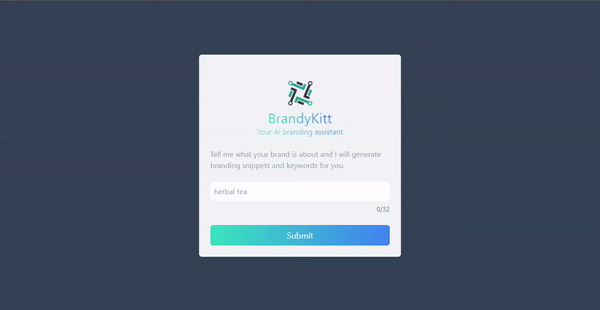

# BrandyKitt

This is a fully functional serverless achitecture driven AI branding assistant webpage with a minimalistic UI.

<br />

**Live demo is [here](https://brandykitt.vercel.app/).**


## 💻 Tech Stack Used


### Backend Stack 
* Language: [Python](https://www.python.org/)
* Framework: [FastAPI](https://fastapi.tiangolo.com/)
* Hosting: [AWS](https://aws.amazon.com/)(Lambda + API Gateway)
* Others: [OpenAI](https://openai.com/), [AWS CDK](https://aws.amazon.com/cdk/), [Docker](https://www.docker.com/)

### Frontend Stack 
* Language: [TypeScript](https://www.typescriptlang.org/)
* Framework: [Next.js](https://nextjs.org/)
* Styling: [TailwindCSS]("https://tailwindcss.com/")
* Icons: [FontAwesome](https://fontawesome.com/icons)
* Linting: [ESLint](https://eslint.org/)
* Code Formatting: [Prettier](https://prettier.io/)
* Hosting: [Vercel](https://vercel.com/)


### Short Preview




```js
export const JustAnotherProject = () => {
  return <>🎉</>;
};
```

## Author

- LinkedIn - [Let's connect 🔗](http://www.linkedin.com/in/yaya-usman)
- Website - [Here](https://yaya-usman.github.io/)
